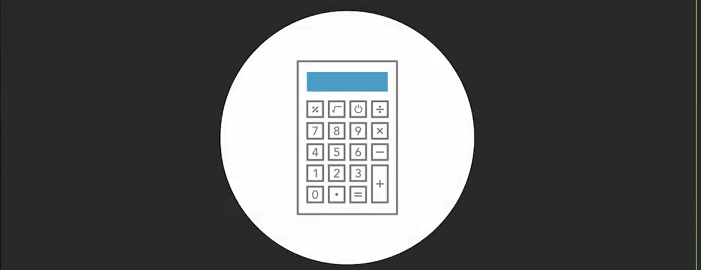

# Les Fondements De D'Intelligence Artificielle
L'intelligence artificielle ou l'IA est un sujet aussi vieux que l'informatique. Cette IA rencontre un succès fulgurant ces dernières années et envahit de plus en plus notre vie de tous les jours. Savez-vous comment elle se définit et comment elle a évolué ? Savez-vous à quoi elle sert ? De quoi est-elle inspirée ? Dans ce cours, Madjid Khichane, ingénieur en informatique et détenteur d'un PhD en IA, apporte des réponses globales à vos questions. Vous allez ici aborder les risques et les menaces liés à l'IA ainsi que les impacts économiques, sociaux et politiques. Vous allez également appréhender l'éthique, la réglementation et la sécurité face au développement de cette intelligence artificielle.

## Définir L'IA

## Connaître Les Débuts De L'IA
### Blaise Pascale En 1642: Pascaline
en 1642, Blaise Pascale invente la machine appélée **la Pascaline** capable d'effectuer de manier automatique des calcules arithmétiques

### 1943: Neurone Formel
au début des année 1943 **Warren McCulloch** et **Walter Pitts** inventent le neurone formel reconnu comme étant le premier model mathématique visant à reproduire le cerveau humain.

### 1949: Neurone Formel + Apprentissage
Donald Hebb ajoute au neurone formel les mecanismes d'apprentissage automatique, ses travaux est né l'idée de développer un ordinateur capable de réaliser les traductions automatiques.

### 1950: Test  De Turing
En 1950, Alan turing a definir le jeu d'imitation dont but était de concevoir une machine capable d'imiter les conversations humaines

### 1955: Logic Theorist
Allen Newell, Herbert A, Cliff Shaw ont écris un programme nommé **Logic Theorist** conçu pour demontrer les théorèmes.
### 1956: Atelier Sur Les Machines Pensantes
Marvin Minsky et John McCarthy orginisent un atélier sur les machines pensantes, cet atélier est marqué comme l'acte de naissance de l'intélligence artificielle.
